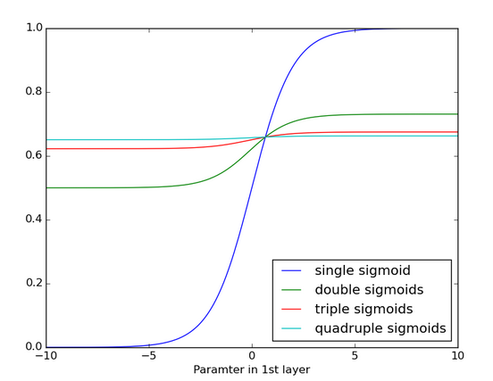

# Maths

## Stats - basics

Correlation is the covariance normalised ($corr(X,Y) = \dfrac{cov(X,Y)}{\sigma_x * \sigma_y}$). Just covar between 2 variables in a way that's more resistant to changes in units.

MLE is an analytical way of saying what is the most likely parameter given this data? MAP is same, but incorporating the prior. For each dist, there's a corresponding way to represent the prior - this is called the conjugate prior distribution.

## Stats with Nadav

#### Stats for Data Science

Why do we need stats? To turn data into knowledge - if there's randomness, if not enough data, etc

Data can be structured - with labels - or not. If not you need to categorise it, but this is a lot of work so be judicious

Semi-structured. A mixture. ie an email

Data can be numeric (discrete/continuous), categorical, ordinal (it has an order) ie days of the week, rankings, arbitrary

Expectation is the mean. Variance is also a mean: it's the mean of the square distance from the mean

Covariance is also a mean (annoying, but what can ya do). It's the connection between 2 variables

(Pearson's) correlation is normalized covariance

Corr is always between -1 and 1, the former high inverse corr and the latter high corr

Lack of corr doesn't mean independence. It means lack of linear independence (like $y=2x$, but nonlinear would be $y=x^2$ or something)

Presence of correlation *does* imply dependence  

#### Models

A model is a way of looking at the data $\sim\mathcal{N}(\mu,\sigma^2)$ (tilde means distributed as, the Normal distribution is the Gaussian bell-curve)

Shoes are not normally distributed since normal goes from $\infty$ to $-\infty$, shoes don't! 

So models aren't reality, but they're helpful ways to think about sutff 

A **parametric model** is a model with paramaters - so in the shoes it might be mean and variance, or in a Bernoulli model ...

Start simple, increase complexity as you go

Likelihood function calculates how likely it is that the data is correct, given the model

We always assume that the data is IID. We can almost never prove it but assume it.

$\mathcal{L}(\theta \mid X) = \prod$ 

#### Maximum Likelihood Estimator

arg max $L(\theta)$

NB MLE is the value of a test statistic (like mu or sigma) given a series of data points. We ask: GIVEN THIS DATA, WHAT IS THE LINE THAT FITS IT (regression)? and we answer, THIS IS THE MAXIMUM LIKELY MEAN (or whatever) FOR THE DISTRIBUTION. 

The mechanics work through derivatives of the log (just to make it easier to work with, but this is less important)

This is easy when finding the max/min is easy
Bernoulli is a binary distribution
We calculate the P~MLE~ for the Bernoulli and found it confirmed our intuition

#### Estimators
the standard error is the standard deviation of the estimator (the hat $\hat{\theta}$ means estimated)

The estimator (MLE) tends toward $\theta$ as $n \to \infty$ and is distributed normally

We can calculate a confidence interval for any confidence level.

## Lecture 2 - Bayesian Inference

$P(A, \bar{B})$

You have priors and posteriors, each of which have distributions. There are recipes: for each distribution, you have a prior distribution (Bernoulli $\rightarrow$ Beta distribution, normal $\rightarrow$ normal, etc.) If posterior and prior are from same family it is known as aa conjugate prior and we say that they are conjugate pairs (I think?) 

In linear regression, the superscript is the dimension number, and the subscript is the row number. 
We transform our data to a matrix. We multiply x by $\beta$, so we have X and Y as matrices and $\beta$s as a vector.

We can calculate the MLE for Y given $X, \beta$. 

Basically: P of A or B is sum, of A and B is product

Flip 2 coins, prob of A being heads or B being heads is 0.5 + 0.5 =1? Can't be

Bayesian Venn diagram shows us the problem, we're double-counting since there's overlap (P of both happening) - so we need the Bayesian formula 

Likelihood (based on [this](https://en.wikipedia.org/wiki/Likelihood_function#Example_1) )

The Likelihood func is the likely prob based on observations

We often use the log-likelihood as it's easier to work with

- $P(A|B) = \dfrac{P(A,B)}{P(B)}$ Or in English, the probability of  seeing A given B is the probability of seeing them both divided by the  probability of B.

- $P(B|A) = \dfrac{P(A,B)}{P(A)}$ Or in English, the probability of  seeing B given A is the probability of seeing them both divided by the  probability of A.

  Thus:

  $P(A|B)*P(B) = P(B|A)*P(A)$

  Which implies:

  $P(A|B) = \dfrac{P(B|A)*P(A)}{P(B)}$

  And plug in $θ$ for $A$ and $X$ for $B$:

  $P(\theta|X) = \dfrac{P(X|\theta)*P(\theta)}{P(X)}$

  Nice! Now we can plug in some terminology we know:

  $Posterior = \dfrac{likelihood * prior}{P(X)}$

  But what is the $P(X)?$ Or in English, the probability of our data?  That sounds weird… Let’s go back to some math and use B and A again:

  We know that $P(B)=∑ AP(A,B)$ (check out this [page ](http://en.wikipedia.org/wiki/Marginal_distribution)for a refresher)

  And from our definitions above, we know that:

  $P(A,B) = P(A|B)*P(A)$

  Thus:

  $P(B) = \sum_{A} P(A|B)*P(A)$

  Plug in our $θ$ and $X$:

  $P(X) = \sum_{\theta} P(\theta|X)*P(\theta)$

  Plug in our terminology:

  $P(X) = \sum_{\theta} likelihood * prior$

  Wow! Isn’t that awesome! But what do we mean by $∑θ$. This means to  sum over all the values of our parameters. In our coin flip example, we  defined 100 values for our parameter p, so we would have to calculated  the likelihood * prior for each of these values and sum all those  answers. That is our denominator for Bayes Theorem. Thus our final answer  for Bayes is:

  $Posterior = \dfrac{likelihood * prior}{\sum_{\theta} likelihood * prior}$
  
#### Hypothesis testing

for each point calculate prob came from norm then get proportion of false/rejected null hyp that's the pop p value

P-value is the prob of everything that is at least as unlikely given H0, and is more than likely given H1

p value is about protecting yourself from a very specific error, that is an error you can point to - not any kind of error. That's why we used one-tail test - we're only looking to compare H0 and H1.

R is the rejection region, the areas for which the p-value is below the threshold - the values for which we reject the hyopthesis. In other words, instead of specifically calculating a sample for p-value, we're comparing the entire sample (I think this is the first HW question?)

If you add two IID normally distributed variables, the sum ahs the sum of the means, the product has the product of the means.

Phi is the CDF of the normal dist. Instead of calculating it, there are tables. C = Zalpha / n is basically the formula we need

If we know the variance - Z-test; if not t-test

## Back to basics: explaining stuff in my own terms

MLE WTF: 

$\mathcal {L} (\mu, \sigma ; data) = P(data; \mu, \lambda)$

Likelihood is to parameters given data what probability is to data given parameters (the semicolon means "given")

The difference between Bayes and frequentist is that f says nothing wihout data, once given data all we can say is "this data comes from distribution X". B says we first take a prior (could be wild guess, but often *we do have a sense* of what it should be), then take data and add that on, then you get a posteriori. So Bayesian equivalent of MLE is MAP.

MLE is at the core of statistical modelling b/c this is what we do day to day in DS: we're given data, and we map it to a model. 

Technically, though MLE asks "how likely is the data given the model with parameter $\theta$"? Why not just ask how likely is the parameter? Answer is that parameter is not an RV: the data is. 

Confidence level + alpha = 1

(Alpha is complement of CL)

If p-value less than alpha, reject null hypothesis

A high alpha level will reject a lot of true hypotheses (Type I error - reject true H0), whereas a too small alpha will accept a lot of false hypotheses (Type II error - not rejecting a false hypothesis)

## Statistical tests

We can do z-tests, t-tests, Chi2 tests (likelihood ratio). The LR is the same as (the term also has a few other meanings in different contexts). Say we want to compare pop mean vs mean of a sample. We could do a z-test, but could also do a LR test. We "approximate the distribution of the "normalized" likelihood ratio (that is, likelihood divided by the maximum likelihood) by a Chi2 distribution and proceed to find what values of the population mean are consistent with that statistics ([source](https://math.stackexchange.com/questions/882393/maximum-likelihood-estimate-vs-likelihood-ratio-tests)).

# Useful SQL commands

SHOW COLUMNS from TABLE;  <- get column names

ALTER TABLE <- to rename column, you can use FIRST to add a first column (or AFTER)

DELETE from TABLE where COLUMN_NAME is NULL LIMIT 10; <- (deletes rows, not cols, also note "is", not =)

needs a limit otherwise won't run in safe update mode

ALTER TABLE DROP columnname < - 

# Numpy/Pandas

rows before columns, always! $M_{i,j}$ means row i, column j

NEVER USE PANDAS METHODS AS FIELD NAMES

Getting a single column can only be done by column name. Slicing by number requires begin and end point

Slicing numpy arrays - use commas to separate dimensions - so slicing a tensor be like (:3, 2:4, 1:5) or whatevs

Pandas - if you want to slice a middle dimension, but not an earlier one, use : so df.loc[:, 2:4, 1:5]

Boolean indexing is on the whole array/DF

Matplotlib line styles - https://matplotlib.org/gallery/lines_bars_and_markers/line_styles_reference.html -- .- etc

sort_index sorts by the index (if primary key, not so interesting. sort_values sorts by values in a column

df.where is boolean indexing - replace where true

Shift tab for help on method, do this a lot!

Axis = row/column (0,1)

matplotib: naming the plot means you're going to address it
so plot(1)
some stuff
plot(2)
soe stuff
plot(1)
more about 1
etc

slicing pandas DFs - iloc is integer-location (going by index number), or loc for name-based locations 

value_counts() is a good way to count

to change values - use loc/iloc to move, and 'at' to *change*

arange gives you ranges. you can find max, min, mean by columns (axis=1 for by row)

For a 2D array, numbers.min() finds the single minimum value in the array, numbers.min(axis=0) returns the minimum value for each column and numbers.min(axis=1) returns the minimum value for each row.

Python zip converts row vectors to column vectors...
A = [1,2]
B = [3,4]
C = [5,6]
for i in zip(A,B,C):
	print i
(1, 3, 5)
(2, 4, 6)
*it's a transpose!*

np.any, np.where are your friends - quick true-false search/boolean masking

Pandas note: if you want just the pandas valus that fit a certain condtion, it's df[df.fart==True]. Using df.where(df.fart==True) will return a df of the same size, with NaNs in place of your values

np.newaxis adds an axis, turning a 2D array into a 3D for eg. But also valuable to turn an arange(100) with shape (100,) into a vector with shape (100,1). Remember, an array of numbers in not automatically a 2D vector (of n by 1), so if you're getting NuPy unable to broadcast issues, make sure they're both these.  

np.random.normal -> draw from normal with loc,std = $\mu, \sigma$ ; np.random.uniform -> draw from intervals at random uniformly

df.plot is awesome, just remember if you have more than one column and want to plot X vs Y, give column names as a string, not columns themselves! So not df.plot(df.foo, df.bar); but df.plot('foo', 'bar')!! 

Annoying pandas stuff: df['a'] selects col A; df['a', 'b'] returns an error...you need df[['a', 'b']]

## Numpy/LinAlg/MatLab Stuff
There are two ways of multiplying two vectors: elements-wise, or dot product. One multiplies, the other multiplies and sums. The former is `np.multiply`, the latter is `@`. An example. Say we use a perceptron to predict a linear classifier (a straight line diving the A circles from the B circles). It may give us weights (coefficients to multiply our xes by) and a scalar term called an intercept (so $y = 3.46x_1 + 0.95x_2 + 5.87$). If you have an array of xes and want to get ys, you do `coefs@xes + intercept`. Numpy magic! 

# Matplotlib

plt.figure() opens a figure
everthing will be held there until you say show(), or open a new figure!

## General DS stuff you were too embarassed to ask

Classification is when data is categorical
Regression is when data is numeric

Overfitting or high variance is when the model captures noise as well as signal - it fits the training data too well.

We can respond to this in one of two ways - feature reduction (eg PCA), and regularisation. The latter is when you have a lot of *slightly* useful features.

Cost function - this is the function judging how wrong you are. You use $\theta$ 's to weigh the different factors.

ROC Curve - super simple method, only for binary classifiers. You graph your TPR and FPR: improvements in the one will generally come at the cost of the other. The 50/50 curve runs down the diagonal - if this is what you get, may as well flip a coin. The y-axis is "always yes", x-axis is "always no". If you're in the upper triangle of the plot then your model is doing well.

Bias = underfitting; variance = overfitting

### Notes from Andrew Ng
Thetas in a cost function: $h_\theta(x) = \theta_0 + \theta_1x_1 + \theta_2x_2 + ... \theta_nx_n$
For multi-variable regression (predicting house prices with multiple features) it's the same process as with one variable. 
If our values are wildly disparate, this can cause havoc with the gradient descent, so we do **regularisation**: 
"Two techniques are feature scaling and mean normalization. Feature scaling involves dividing the input values by the range (i.e. the maximum value minus the minimum value) of the input variable, resulting in a new range of just 1. Mean normalization involves subtracting the average value for an input variable from the values for that input variable resulting in a new average value for the input variable of just 0. For both, adjust your input values as shown in this formula: 
$x_i:= \dfrac{x_i - \mu_i}{s_i}$

Where $\mu_i$ is the average of all the values for feature (i) and $s_i$ is the range of values (max - min), or $s_i$ is the SD.

We don't need to do gradient descent - we can do normal equation and solve the entire matrix at once. This is more accurate and doesn't have as much room for error, but more computationally expensive. In practice at about 10k might want to switch methods.

#### Logistic Regression (week III)
This is where we get into classification. We want to map everything to between 1 and 0 (yes or no), so in practice we use a sigmoid function $\dfrac{1}{1 + e^{-z}}$ (where z is $\theta^{T}x$). It gives us the probability (if it's 0.7, there's 0.7 probability that yes)

Dealing with overfitting either by 1) reducing the number of features: (manually select which features to keep, use a model selection algorithm), or 2) Regularization (Keep all the features, but reduce the magnitude of parameters $\theta_j$. Works well when we have a lot of slightly useful features.)

Regularisation: sometimes you want it to be quadrati, but you don't want the $x^3, x^4$ to have too much weight. To counter this, what if we added a condition that our cost function find the lowest cost for (cost function) + 1000x4? That way we'd need to make sure our higher x had a very low impact.

We formalise this with the term $\lambda$.

### Neural Nets (weeks 4-5)

OK, so same as before but we're scaling up. We now have a network made of "layers" of "nodes" - where each of the xes goes into each node, and is multiplied by the weights (thetas), plus the bias unit. The value for each node in each layer is the "activation function" of (all the inputs * all the weights) + bias. Each layer has a matrix of weights: enough weights for all the xes, for all the nodes in the layer.  If layer one has 3 noes and layer 2 has 4, the weights for layer 1 ill be **4 x 4**, because you add one for the bias in the **current layer**, but not for the output to the next layer.

To reiterate: with fully-connected layers, your weights $(\theta)$ matrix has rows = xes + 1, and cols = # of nodes

Multi-class classification has multiple nodes in the output layer - one for each x

Backpropagagtion involves finding the partial derivatives (the delta, $\delta$) of theta for each node in each layer, and then summing these in a a matrix (big delta, $\Delta$). We don't find error for the first layer b/c it's our input data.

Number of hidden units per layer = usually more the better (must balance with cost of computation as it increases with more hidden units)

# Data Modeling 

####  Some real basics
Supervised learning is classification/regression: we have labelled data and some unlabelled that we want to predict.
Unsupervised learning is modelling/clustering: you have no labels, tring to find a shape.
Reinforcement: we haven't gotten to it - watch this space...

### Lecture I

Bias is how far away you are, variance is how big the error range is. See slides for examples. Neither is good, and they are to some extent reversely proportionate. Best is a middle point.

Linear Regression

for continuous data. For the simplest case (univariate), we use the mean squared error - this way we penalizes much more for farther deviations

Gradient descent is based on the idea that as you move away from a max/min point, your rate of change increases. So we want to move away from this, we keep moving and comparing the difference in steps, minimising them, until we get to the smallest local move - that's a local minimum

Univariate: Multivariate :: House prices by area:House prices by area, age, location...

regularisation is modifying the impact of larger factors in polynomial expressions (we want our higher power thetas to have more of an impact) we multiply it by a lambda

Linear regression is for a continous outcome what is y's connection to x. Logistic regression is for categorical applications: yes or no; a, b or c

One form of regularisation is ridge regression/LASSO. Here's the deal with these (mostly taken from [here](https://en.wikipedia.org/wiki/Tikhonov_regularization)). You want to do regression using your common or garden Ordinary Least Squares cost function. But the solution is not unique (we call it an ill-formed problem), giving you under- or over-fitting. In this case, we add an extra term which we try to minimise. The goal is to remove some of the factors, get rid of the ones that contribute less and find the ones that count most. L1 uses absolute value, L2 uses the square (Euclidean distance or some such). Either way it is related to the "norm" - the "size" of the vector.

### Lecture II -  Binary Classfiers

Not all errors are equal, for eg in  medicine false positive not equal to false negative
the famous "confusion matrix" quadrant
in autonomus driving, true negatives might be infinite. they will skew everything and are not very interesting
so you get all kinds of alternative methods of weighting them: not just +1 for TP, TN and -1 for FP, FN, but for eg:
False Discovery Rate: how many of ur yeses were wrong?
Miss Rate: how many of the actual yeses did you miss?
more here: https://en.wikipedia.org/wiki/Precision_and_recall#Definition_(classification_context) 
so we have tradeoffs
we can maximise in bizarre ways (always return True for eg), but everything depends on situation

AUC of the ROC curve is a common measure in the ML community, the idea is that the integral (area under the ROC curve) is the likelihood that we will rank a random positive higher than a random negative

F-score is the harmonic mean (a special kind of mean, pretty siple, goes back to Pythagoras) of precision and recall

Part 2 of the lecture is about a Naive Bayesian classifier. We calculate the MAP, which is basically what your best guess is taking into account your prior and posterior probabilities. Mathematically it is about maximising the argument - it's the mode (highest point) of the posterior distribution

A note about Naive Bayes: how do we go from Bayes *theorem* to **classifier**? Answer is that given p of Y (later event) and of X (earlier), if we want to calculate P(Y|X) we use bayes theorem. But if we want P(X|Y) - in other words, given the fact, what is the most likely probability that produced it? - this is called finding the posterior. That's what a Bayesian classifier does. It's naive if it assumes that every dimension (column, all 784 pixels) is independent, so you can just multiply the probabilities to get the total probability. 

In gradient descent, we need to choose $\alpha$ (step size) in such a way that we get to the right local minimum. If it's too big, we'll overshoot; too small, we'll take too long.

Naive Bayesian assumes that all features are independent (no correlation between them) - that's why it's naive. 

Quote from WP: "For example, a fruit may be considered to be an apple if it is red, round, and about 10 cm in diameter. A naive Bayes classifier considers each of these features to contribute independently to the probability that this fruit is an apple, regardless of any possible correlations between the color, roundness, and diameter features."

For Gaussian naive Bayes, we must estimate the mean + variance for each feature of each class. then just plug and run...

logistic regression

probability of y or n based on continuous features 

we use the logit function, the invrse of the familiar S-shaped "logistic" curve (google it...)

great resource for PCA, if simplified: http://www.cs.otago.ac.nz/cosc453/student_tutorials/principal_components.pdf (relevant bits are only a couple of pages)
this sumarises PCA as getting orthogonal eigenvectors of the covar matrix (in class we used a slightly more sophisticated method), sorting from biggest to smallest, choosing the top p vectors (optional) and recombining them into a matrix, and then multiplying by the data. The data will have p dimensions if we dropped some, but even if we don't PCA is transformative.

Unsupervised 2: Clustering

clustering is an alternative to PCA. we assign everything a cluster (arbitrarily at first), then iteratively measure distance from centroids of clusters to members and reassign them to nearest centroid.

# Clustering - Danny Barash

Ordinal means can be ordered - say, 1 to 5 stars
then there's numeric (simple)
and categorical (can't be ordered)

Supervised learning is for predictions (labeled data)
Unsupervised is for finding structure
Most data in the wild is unlabeled

We discussed kNN and k-means, hierarchical clustering

Distance function must be positive, symmetric (same from A to B and from B to A), and must fit the triangle inequality (dist between A and B can't be greater than distance between either and C)

There's also correlation distance, absolute, maximal

If we have big gaps between types of objects, (socks and computers) we should normalize

 

### Lecture 4 - SVD
A singular matrix is one that has a determinant of 0. **This means it cannot be inverted.**(The inverse is the matrix which gives *I* when multiplied by original matrix.) 
We can do something called the Moore-Penrose pseudo-inverse, using SVD. 
SVD can handle any matrix, even non-square, non-symmetric. 
We can break down (factorize) any matrix into $X = U\Sigma V^T$, where U,V are orthogonal and $\Sigma$ is diagonal.
U and V are called the singular vectors. 
U and V are orthogonal: that means that their transpose is also their inverse. 
They are also singular, this is almost the same, but for complex matrices, see [here](https://www.quora.com/What-is-the-difference-between-a-unitary-and-orthogonal-matrix) 
</img>

Visualisation of a singular value decomposition (SVD) of a 2-dimensional, real shearing matrix M. First, we see the unit disc in blue together with the two canonical unit vectors. We then see the action of M, which distorts the disc to an ellipse. The SVD decomposes M into three simple transformations: a rotation V*, a scaling Σ along the rotated coordinate axes and a second rotation U. Σ is a diagonal matrix containing in its diagonal the singular values of M, which represent the lengths σ1 and σ2 of the semi-axes of the ellipse (from [Wikipedia](https://en.wikipedia.org/wiki/Singular_value)). 
 
U and V are inverse of one another. 
So if you can't get the inverse you can get the pseudo-inverse via SVD:  
> $X = UDV^T$ 
> $X' = UD'V^T$
<cr>For each value in the diagonal (Dii), you either take 1/prev, or if prev = 0, take 0.
    
You can run SVD on your input. If the matrix is almost singular (ie variables are very close to linearly dependent on others), then take out the near-zeroes otherwise it can hurt your data analysis.  

## Convolutional Neural Networks

"**The bread and butter of neural networks is _affine transformations_: a vector is received as input and is multiplied with a matrix to produce an output (to which a bias vector is usually added before passing the result through a non-linearity)**.  This is applicable to any type of input, be it an image, a sound clip or an unordered collection of features: whatever their dimensionality, their representation can always be flattened into a vector before the transformation. Images, sound clips and many other similar kinds of data have an intrinsic structure. More formally, they share these important properties:

-  They are stored as multi-dimensional arrays.
-  They feature one or more axes for which ordering matters (e.g., width and height axes for an image, time axis for a sound clip).
-  One axis, called the channel axis, is used to access different views of the data (e.g., the red, green and blue channels of a color image, or the left and right channels of a stereo audio track).

These properties are not exploited when an affine transformation is applied; in fact, all the axes are treated in the same way and the topological information is not taken into account. Still, taking advantage of the implicit structure of
the data may prove very handy in solving some tasks, like computer vision and speech recognition, and in these cases it would be best to preserve it. This is where discrete convolutions come into play.

A discrete convolution is a linear transformation that preserves this notion of ordering. It is sparse (only a few input units contribute to a given output unit) and reuses parameters (the same weights are applied to multiple locations
    in the input)." [source](https://arxiv.org/pdf/1603.07285.pdf)

_Pooling_ is basically like convolution - you pass a kernel over it, but instead of multiplying by a kernel weight, you do something else (like the average or the max), the point of it is to reduce the size of your input.

## Spilling all the t* on LSTMs
*$(t_1, t_2, t_3...)$

Some ideas from [DJ Colah](http://colah.github.io/posts/2015-08-Understanding-LSTMs/):  In an RNN, each single neuron (in a regular network) is in fact a rolled up neuron that takes in all of the input (per batch). It then feeds each output ($h_1,h_2....h_t$) into the next one.  

More specifically, it cycles back into itself, and the unrolling is only a metaphor. Something like this: 

So instead of normal backpropagation we do backpropagation through time - ie with an added time element. But it's restricted becuase the computation quickly gets out of control, so in an RNN, each t only takes into accout a few ts backwards. Also, RNNs have the vanishing/exploding gradient problem - each time you take a sigmoid, you increase the likelihood that it will flatline! 

#### LSTMs to the rescue
LSTMs do all this, but with a hidden state $C$, that has four different "gates" (basically each one is just a linear combination with a different role - forget, remember, etc.). Without going into the details right now, this state is preserved, meaning that we can retain all of the info from a batch of input data. Thus LSTMs have become the most popular implementation of RNNs. 

#### Architecture
In Keras (we'll use the Sequential rather than the Functional API b/c that's how my boy Jason Bradley rolls, but they're very similar), you create an LSTM with the method: `model.add(LSTM(128), input_shape=(1, X_train.shape[1]))`  That is, 128 is the number of neurons in each layer, and `input_shape` is the size of the "unrolled" neuron (the amout of data to pass through your neuron). The `return_sequences` flag gives you the option to return all of the stages of the LSTM.

#### Early Stopping
Monitors a paramater (loss, val_accuracy) and ends early if it hasn't improved for n epochs 

### Pandas stuff I'm TIRED OF GOOGLING
Display rows with NaN: `df[df.isnull().any(axis=1)]` 
Search for text in text column: `df[df.text_column.str.contains('whatever')]` 
Adjust figsize for entire notebook: `plt.rcParams['figure.figsize'] = [12.0, 6.0]` 
Copy-paste pandas table from SO: `df=pd.read_clipboard(sep='\s\s+', engine='python'); df.head()` 
Group-apply-combine: `df.groupby(['col1', 'col2'])['col3'].mean()` 
Two conditions mask: col A is x, col B not NaN: `df[(df['A'] == '2013') & (~pd.isnull(df['B']))]` 
Subplots in Matplotlib: look [here](https://stackoverflow.com/a/38438533/6220759)!!!!!!!! (`subplot2grid`)
***

## [Guy on Reddit](https://old.reddit.com/r/datascience/comments/7cx9yt/how_to_learn_pandas/) with Strong Opinions
Once you have finished your first kernel, you can go back to the documentation and complete another section. Here is my recommended path through the documentation [(source)](https://medium.com/dunder-data/how-to-learn-pandas-108905ab4955):

    Working with missing data
    Group By: split-apply-combine
    Reshaping and Pivot Tables
    Merge, join, and concatenate
    IO Tools (Text, CSV, HDF5, …)
    Working with Text Data
    Visualization
    Time Series / Date functionality
    Time Deltas
    Categorical Data
    Computational tools
    MultiIndex / Advanced Indexing

### Relevant HN discussion [(link)](https://news.ycombinator.com/item?id=17075126)
For a large fraction of probability theory, you only need two main facts from linear algebra.

First, linear transforms map spheres to ellipsoids. The axes of the ellipsoid are the eigenvectors.

Second, linear transforms map (hyper) cubes to parallelpipeds. If you start with a unit cube, the volume of the parallelpiped is the determinant of the transform.

That more or less covers covariances, PCA, and change of variables. Whenever I try to understand or re-derive a fact in probability, I almost always end up back at one or the other fact.

They're also useful in multivariate calculus, which is really just stitched-together linear algebra.

reply:I think the first point is only true for symmetric matrices (which includes those that show up in multivariable calc). In general, the eigenvectors need not be orthogonal.

reply:Yep, you could well be right. The image of an ellipse under a linear transform is definitely an ellipse, but I'm not sure about the eigenvectors in the general case.

The symmetric case is by far the most relevant for probability theory though.

reply:In general it's the eigenvectors of the positive-semidefinite (hence symmetric) part of the left polar decomposition.
